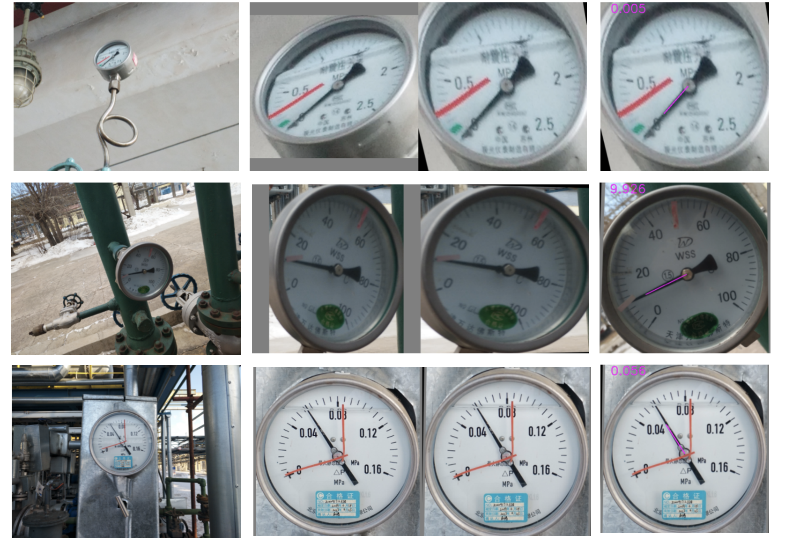
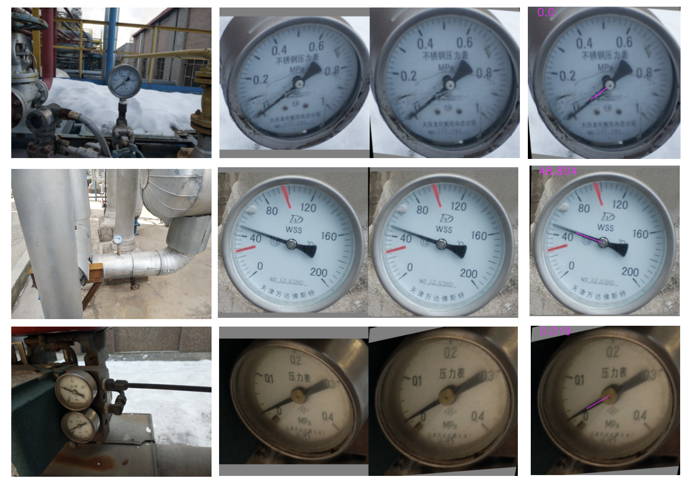
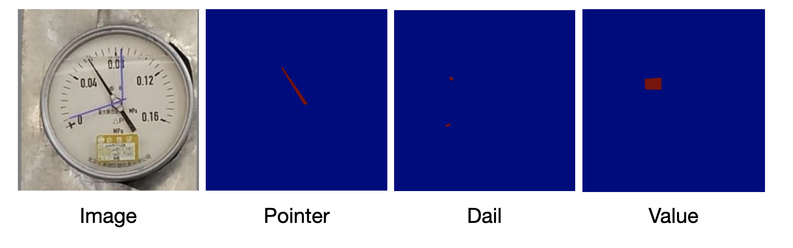

# Detect and Read meters in the wild
This is areleased system towards detection and recognition of complex meters in wild. The system can be divided into three moduels. Fisrtly, a yolo-based detector is applied to get pure meter region. Secondly, a spatial transformer module is eatablished to rectify the position of meter. Lastly, an end-to-end network is to read meter values, which is implemented by pointer/dail predcition and key number learning.    

## Visulization results



Left row is the original image, middle row is the process of meter rectification, right row is the result of meter value reading.


## ToDo List

- [x] Release testing code
- [x] Release training code and dataset
- [x] existing three-stage models
- [ ] A new branch for digital-meter recognition
- [x] Document for testing
- [x] Document for training
- [x] Demo script for single image


## Installation

### Requirements:
- Python3 (Python3.7 is recommended)
- PyTorch >= 1.0 
- torchvision from master
- numpy
- skimage
- OpenCV==3.0.x
- CUDA >= 9.0 (10.0 is recommended)

## Meter Detection 
We use official YOLO-V5 to detect meters.

We release a dataset for training model, which can be downloaded from [data_detection]( https://drive.google.com/file/d/1RKcqJ0RWaBPpBbMtWwcgQ4S66Iwf97RS/view?usp=drive_link) The data is COCO-format and label 0 and 1 represent pointer meters and digital meters.

We also provide trained weight in [yolo_weight](https://drive.google.com/file/d/1bHYpJro3ERmNTRO2JEo1inyU0_juqw5z/view?usp=drive_link) You dan put it in the yolov5 folder for inference.

## Meter Alignment
We implement meter alignment by STN network. However, we obseve it is time-consuming. Thus we remove it in the latest version. You can still find it in the master branch. We also provide the weight you can refer in [alignment weight](https://drive.google.com/file/d/1406CI_GqRBpXn1-AChM6NzdX8r9FAXl-/view?usp=sharing)

## Meter Recognition
We design a network for read meters, which consists of a pointer prediction head, dail prediction head, and a ocr-based value prediction head. By a post-processing method, meter readings can be obtained.

The dataset for training the network has been realsed in [data](https://drive.google.com/file/d/1fFSSwoWAHkZWqgVCuqwOSFjSVfkjGk2U/view?usp=drive_link) the data is annotated by Labelme tool. "Train" folder contains pointer and dail information, and "Train1" folder contains value information. 

You can run ```python viz_label.py``` to visualize different annotations.



You can run ```python train.py``` to train your own dataset. The training configurations are in ```util/option.py```

We also provide trained weight in [read_weight](https://drive.google.com/file/d/1sHmEEf9E0_kvL0LW1S5Y5jjFgjx_O5Dj/view?usp=drive_link) You should put it in the ```model/meter_data```

## Demo 
You can run a demo script for a single image inference.

```python predict_online.py```

## Paper
The project only for academic research, if you are interested in it, please star our project! And cite our paper as follows:
```
@misc{shu2023read,
      title={Read Pointer Meters in complex environments based on a Human-like Alignment and Recognition Algorithm}, 
      author={Yan Shu and Shaohui Liu and Honglei Xu and Feng Jiang},
      year={2023},
      eprint={2302.14323},
      archivePrefix={arXiv},
      primaryClass={cs.CV}
}
```


